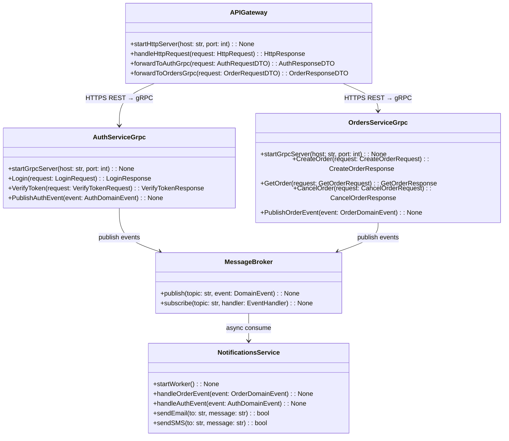
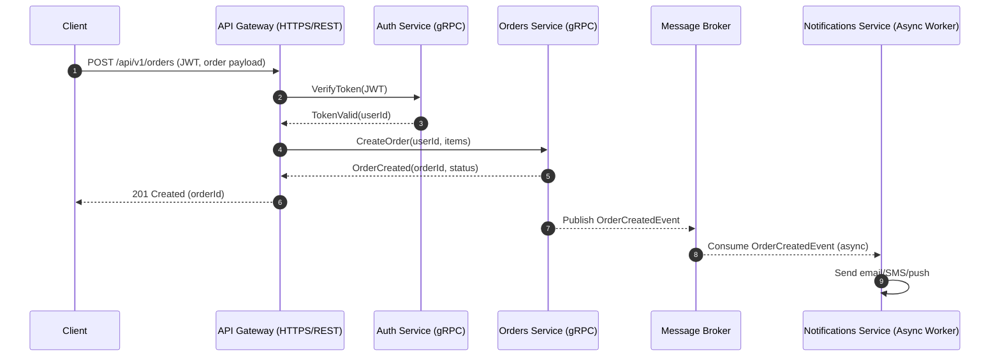
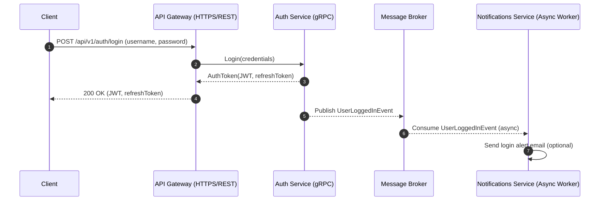
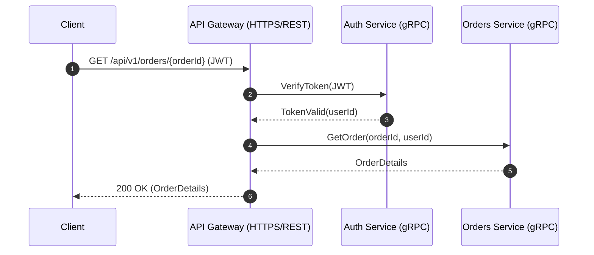

# DI-405
the micro services for docker containers

# Main Arch

```mermaid
classDiagram
    class APIGateway {
        +startHttpServer(host: str, port: int): None
        +handleHttpRequest(request: HttpRequest): HttpResponse
        +forwardToAuthGrpc(request: AuthRequestDTO): AuthResponseDTO
        +forwardToOrdersGrpc(request: OrderRequestDTO): OrderResponseDTO
    }

    class AuthServiceGrpc {
        +startGrpcServer(host: str, port: int): None
        +Login(request: LoginRequest): LoginResponse
        +VerifyToken(request: VerifyTokenRequest): VerifyTokenResponse
        +PublishAuthEvent(event: AuthDomainEvent): None
    }

    class OrdersServiceGrpc {
        +startGrpcServer(host: str, port: int): None
        +CreateOrder(request: CreateOrderRequest): CreateOrderResponse
        +GetOrder(request: GetOrderRequest): GetOrderResponse
        +CancelOrder(request: CancelOrderRequest): CancelOrderResponse
        +PublishOrderEvent(event: OrderDomainEvent): None
    }

    class MessageBroker {
        +publish(topic: str, event: DomainEvent): None
        +subscribe(topic: str, handler: EventHandler): None
    }

    class NotificationsService {
        +startWorker(): None
        +handleOrderEvent(event: OrderDomainEvent): None
        +handleAuthEvent(event: AuthDomainEvent): None
        +sendEmail(to: str, message: str): bool
        +sendSMS(to: str, message: str): bool
    }

    %% Relationships (Async)
    APIGateway --> AuthServiceGrpc : HTTPS REST → gRPC
    APIGateway --> OrdersServiceGrpc : HTTPS REST → gRPC

    AuthServiceGrpc --> MessageBroker : publish events
    OrdersServiceGrpc --> MessageBroker : publish events

    MessageBroker --> NotificationsService : async consume

```

# Create Order flow

```mermaid
sequenceDiagram
    autonumber
    participant Client
    participant GW as API Gateway (HTTPS/REST)
    participant Auth as Auth Service (gRPC)
    participant Orders as Orders Service (gRPC)
    participant Broker as Message Broker
    participant Notif as Notifications Service (Async Worker)

    Client->>GW: POST /api/v1/orders (JWT, order payload)
    GW->>Auth: VerifyToken(JWT)
    Auth-->>GW: TokenValid(userId)

    GW->>Orders: CreateOrder(userId, items)
    Orders-->>GW: OrderCreated(orderId, status)

    GW-->>Client: 201 Created (orderId)

    Orders-->>Broker: Publish OrderCreatedEvent
    Broker-->>Notif: Consume OrderCreatedEvent (async)
    Notif->>Notif: Send email/SMS/push
```

# Login flow

```mermaid
sequenceDiagram
    autonumber
    participant Client
    participant GW as API Gateway (HTTPS/REST)
    participant Auth as Auth Service (gRPC)
    participant Broker as Message Broker
    participant Notif as Notifications Service (Async Worker)

    Client->>GW: POST /api/v1/auth/login (username, password)
    GW->>Auth: Login(credentials)
    Auth-->>GW: AuthToken(JWT, refreshToken)

    GW-->>Client: 200 OK (JWT, refreshToken)

    Auth-->>Broker: Publish UserLoggedInEvent
    Broker-->>Notif: Consume UserLoggedInEvent (async)
    Notif->>Notif: Send login alert email (optional)
```

# 🧾 Get Order Details Flow (Read-only, no notifications)

```mermaid
sequenceDiagram
    autonumber
    participant Client
    participant GW as API Gateway (HTTPS/REST)
    participant Auth as Auth Service (gRPC)
    participant Orders as Orders Service (gRPC)

    Client->>GW: GET /api/v1/orders/{orderId} (JWT)
    GW->>Auth: VerifyToken(JWT)
    Auth-->>GW: TokenValid(userId)

    GW->>Orders: GetOrder(orderId, userId)
    Orders-->>GW: OrderDetails

    GW-->>Client: 200 OK (OrderDetails)
```