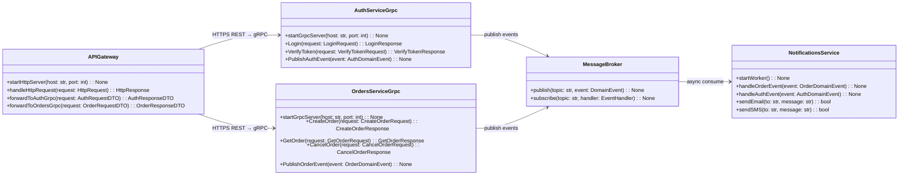

# DI-405
the micro services for docker containers

```mermaid
classDiagram
    direction LR

    class APIGateway {
        +startHttpServer(host: str, port: int): None
        +handleHttpRequest(request: HttpRequest): HttpResponse
        +forwardToAuthGrpc(request: AuthRequestDTO): AuthResponseDTO
        +forwardToOrdersGrpc(request: OrderRequestDTO): OrderResponseDTO
    }

    class AuthServiceGrpc {
        +startGrpcServer(host: str, port: int): None
        +Login(request: LoginRequest): LoginResponse
        +VerifyToken(request: VerifyTokenRequest): VerifyTokenResponse
        +PublishAuthEvent(event: AuthDomainEvent): None
    }

    class OrdersServiceGrpc {
        +startGrpcServer(host: str, port: int): None
        +CreateOrder(request: CreateOrderRequest): CreateOrderResponse
        +GetOrder(request: GetOrderRequest): GetOrderResponse
        +CancelOrder(request: CancelOrderRequest): CancelOrderResponse
        +PublishOrderEvent(event: OrderDomainEvent): None
    }

    class MessageBroker {
        +publish(topic: str, event: DomainEvent): None
        +subscribe(topic: str, handler: EventHandler): None
    }

    class NotificationsService {
        +startWorker(): None
        +handleOrderEvent(event: OrderDomainEvent): None
        +handleAuthEvent(event: AuthDomainEvent): None
        +sendEmail(to: str, message: str): bool
        +sendSMS(to: str, message: str): bool
    }

    %% Relationships (Async)
    APIGateway --> AuthServiceGrpc : HTTPS REST → gRPC
    APIGateway --> OrdersServiceGrpc : HTTPS REST → gRPC

    AuthServiceGrpc --> MessageBroker : publish events
    OrdersServiceGrpc --> MessageBroker : publish events

    MessageBroker --> NotificationsService : async consume

```